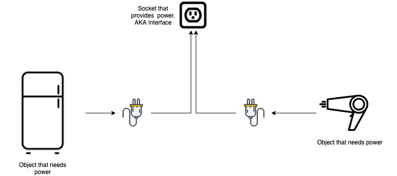
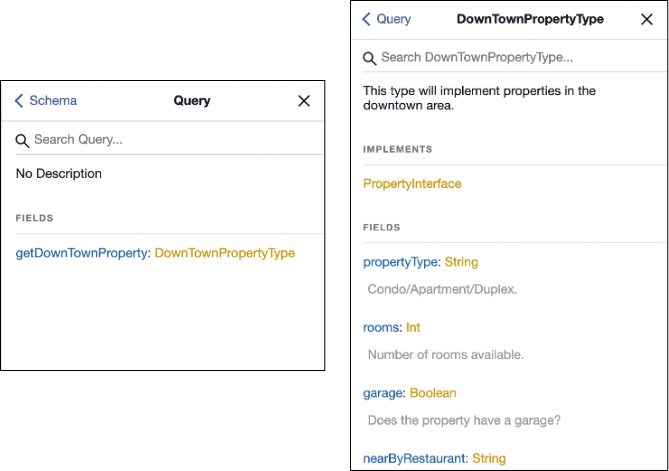
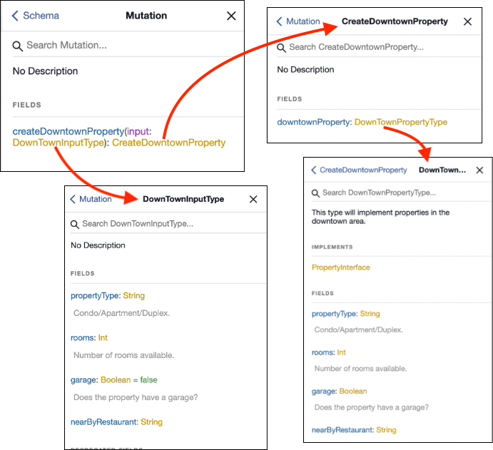
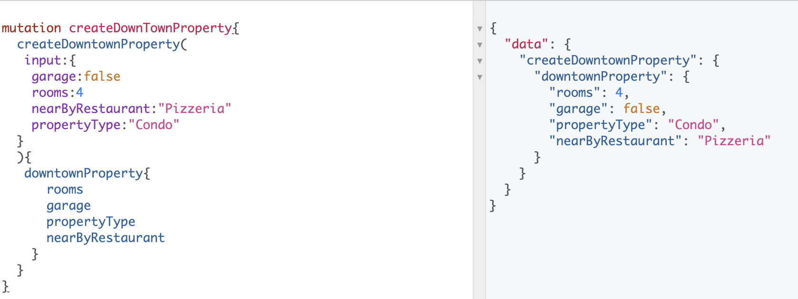

# GraphQL interfaces

Also known as abstraction, mixin, base classes. Although, I like the word interface because it reminds
me of its similarity with an electric socket, that needs something to be plugged into it to be useful.

<!-- more -->

In the image below, we can see the behavior of an interface (socket). 



It merely provides power to the objects nothing more. If the objects are powered using a battery, then we don't even
need the interface (socket) except for charging the batteries, but you get the idea.

## Usage

The big picture is you need an interface if one or more objects share a common way to operate. 

__BUT__ don't overuse it. Just because you have a socket doesn't mean you don't check the voltage, shape of the plug, or electric bill. You
have to be cautious. 

### Key difference

Often missed in explanations is that interfaces are meant to be used for returning object types. Meaning if you want to use
them to create/update data don't use interfaces. Go with creating a base class in your preferred language.

## How to use interfaces (in queries/reading data)?

Let's say we want to build an API for the housing market.

__Note__: examples are using graphene which is a python library. And, again interfaces are meant to return data and not create data.

### types.py
```python
import graphene

class PropertyInterface(graphene.Interface):
    """
    A generic base class that all property types should implement.
    """
    property_type = graphene.String(description="Condo/Apartment/Duplex.")
    rooms = graphene.Int(description="Number of rooms available.")
    garage = graphene.Boolean(description="Does the property have a garage?",
                              default_value=False)
    
class DownTownPropertyType(graphene.ObjectType):
    """
    This type will implement properties in the downtown area. 
    """
    class Meta:
        interfaces = (PropertyInterface,)

    near_by_restaurant = graphene.String()
```

### schema.py
```python
import graphene
from . import types


class Query(graphene.ObjectType):
    get_down_town_property = graphene.Field(types.DownTownPropertyType)

schema = graphene.Schema(query=Query)
```

<br/>

### GraphiQL viewer

Using the viewer we can take a look at the `get_down_town_property` query:

 

<br/>

This means when we query `get_down_town_property` we have access to the interface fields as well.

```python
query getDowntownProperty{
  getDownTownProperty{
    propertyType # Inherited from interface
    rooms    # Inherited from interface
    garage  # Inherited from interface
    nearByRestaurant
  }
}
```
<br/>

We will use ☝️ type in a mutation that is created ⬇️

<br/>

---

## Using a base class as an interface in mutations.

### types.py
```python
# Here we are using graphene.InputObjectType instead of graphene.Interface.
class PropertyInputBase(graphene.InputObjectType):
    """                            
    A generic base class that all input objects should implement.
    """
    property_type = graphene.String(description="Condo/Apartment/Duplex.")
    rooms = graphene.Int(description="Number of rooms available.")
    garage = graphene.Boolean(description="Does the property have a garage?",
                              default_value=False)
                        
# Inherit the PropertyInputBase (aka interface, aka base class)
class DownTownInputType(PropertyInputBase, graphene.InputObjectType):
    near_by_restaurant = graphene.String()
```

### schema.py
```python

class CreateDowntownProperty(graphene.Mutation):
    class Arguments:
        input = types.DownTownInputType()
    
    # Output type of the data. 
    # Note: We are using graphene.ObjectType that uses an interface.
    downtown_property = graphene.Field(types.DownTownPropertyType)

    def mutate(root, info, input):
        return CreateDowntownProperty(downtown_property=input)


class Mutation(graphene.ObjectType):
    create_downtown_property = CreateDowntownProperty.Field()

schema = graphene.Schema(mutation=Mutation)
```
<br/>

Below is a screenshot that shows the flow of mutation. Here we have an input which uses the `DownTownInputType` that uses
a shared base class. Whereas the output is of type `DownTownPropertyType` which uses an interface created above.



<br/>

We can call the mutation from the GraphiQL viewer in the following way:



<br/>
<br/>

## Resources
> There are some great examples mentioned in the [Production Ready Graphql](https://book.productionreadygraphql.com/) which is a 
book written by [Marc-André Giroux](https://twitter.com/__xuorig__).
> 
>Graphene [documentation](https://docs.graphene-python.org/projects/django/en/latest/).
> 
> The API team at my work [Octopus Energy](https://octopus.energy/).

<br/>

If you have any questions or comments reach out to me via [twitter](https://twitter.com/tahaaakhan)
